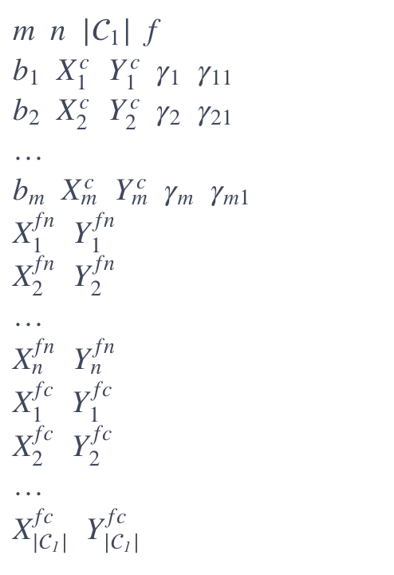

# Instances and detailed computational results of the paper: 

### An efficient branch-and-cut approach for large-scale competitive facility location problems with limited choice rule

### Wei-Kun Chen, Wei-Yang Zhang, Yan-Ru Wang, Shahin Gelareh, Yu-Hong Dai

---

This repository contains the instances of testsets T1 and T2, and the detailed results of the computational experiments conducted for the paper "An efficient branch-and-cut approach for large-scale competitive facility location problems with limited choice rule". 

#### [https://arxiv.org/abs/2406.05775](https://arxiv.org/abs/2406.05775)

### Data

The testsets T1 and T2 contain the competitive facility location problem with limited choice rule (CFLPLCR) instances where a newcomer company selects facility locations while competing with the existing open facilities of a single existing competitor.

Format of the instance files:

where 
- $m$ is the number of customers, 
- $n$ is the number of potential facility locations considered by the newcomer, 
- $|\mathcal{C}_1|$ is the number of competitor's opened facilities,  
- $f$ is the fixed cost per newcomer facility,
- for each customer $i \in [m]$ in a row, 
    - $b_i$ is the buying power of customer $i \in [m]$, 
    - $(X^c_i, Y^c_i)$ are the coordinates of customer $i$, 
    - $\gamma_i$ and $\gamma_{i1}$ are the maximum numbers of facilities of the newcomer company and competitor's open facilities, respectively, that will be considered by customer $i \in [m]$;
- for each facility location $j \in [n]$ of the newcomer, $(X^{fn}_j, Y^{fn}_j)$ are its coordinates,
- for each facility $j \in \mathcal{C}_1$ of the competitior, $(X^{fc}_j, Y^{fc}_j)$ are its coordinates.

For the CFLPJLCR instances, only $\gamma_i$ is presented, which denotes the maximum numbers of facilities that that will be considered by customer $i \in [m]$.

### Algorithms 

The following algorithms are compared in the computational experiments:

- **B&C+SI**: The proposed B&C algorithm based on formulation (16) (equipped with the submodular inequalities).
- **B&C+LSI**: The proposed B&C algorithm based on formulation (40) (equipped with the lifted submodular inequalities).
- **GBD**: A two-stage implementation of the stage-of-the-art generalized Benders decomposition (GBD) approach proposed by Lin & Tian (2021).
- **sB&C+LSI**: The proposed B&C algorithm based on formulation (40) (equipped with the lifted submodular inequalities), with only the second stage implemented.
- **Greedy**: The greedy algorithm for the CFLPLCR (see Appendix A of the online supplement).
- **B&C+LSI+MILP** (i.e., B&C+LSI'): The proposed B&C algorithm based on formulation (40) (equipped with the lifted submodular inequalities), where the lifted submodular inequalities are computed by using the MILP based approach that solves the MILP reformulations (E.2) in Appendix E of the online supplement of the lifting problems (43).
- **CP+BI**: Solving the CFLPLCR by the CP approach of the Benders reformulation of Lin & Tian (2021), where the Benders inequalities are generated in each iteration and the master problem is solved again as an MILP problem.
- **CP+B&C**: Solving the CFLPLCR by the CP approach of formulation (40), where the lifted submodular inequalities (40a)–(40b) are generated in each iteration and the master problem is solved again as an MILP problem.

Besides, the following two algorithms for the competitive facility location problem with joint limited choice rule (CFLPJLCR) are compared in the computational experiments:
- **iB&C+LSI**: Solving the CFLPJLCR by the iterative approach in Algorithm 1 in the online supplement, in which the CFLPLCR subproblems are solved by the proposed B&C algorithm based on the lifted submodular inequalities.
- **Gurobi**: Solving the MILP formulation (H.6) (see Appendix H of the online supplement) of the CFLPJLCR by the B&C algorithm of Gurobi.

### Results

The log files of the above algorithms for the instances are provided in the directory **Results**.

### CSV Data Details

The CSV files `T1.csv`, `T2.csv`, and `CFLPJLCR.csv` contain detailed computational results for all CFLPLCR instances in testsets T1 and T2 and all CFLPJLCR instances (as described in the Appendix H in the online supplement).

The CSV file contains the following columns:

#### Instance Parameters

- **m**: Number of customers.
- **n**: Number of potential facility locations considered by the newcomer.
- **gamma**: Size of the consideration sets of customers.

#### Instance Results

- **T(G%)**: Total CPU time in seconds, and if the instance cannot be solved to optimality within the given time limit, we report the percentage optimality gap, computed as (UB − LB) / UB $\times$ 100%, where UB and LB denote the upper bound and the lower bound obtained at the end of the time limit;
- **TC**: Time in seconds spent in separating the cuts;
- **N**: The number of explored nodes;
- **v**: The objective value of the optimal solution or the best incumbent of the instance;
- **UB^1** and **LB^1**: The upper bound and lower bound of the optimal value returned at the end of the first stage;
- **LPG%**: The percentage LP gap defined by (UB^1 - $v^*$) / UB^1 $\times 100\%$, where $v^* = \max\{v_{\text{SI}}, v_{\text{LSI}}\}$ denotes the best objective value of incumbents under settings B&C+SI and B&C+LSI;
- **C^1**: The number of cuts added at the end of the first stage for the initialization of the relaxed MILP problem of (40);
- **UB^2**: The upper bound obtained at the root node of Gurobi (in the second stage);
- **T^MILP**: The average CPU time in seconds spent in solving a single MILP problem; 
- **It**: The number of iterations (in the CP approach for the CFLPLCR or in the iterative approach for the CLFPJLCR).

The `--` under columns T(G%) and v for settings CP+LSI and CP+BI denote that the instance cannot be solved to optimality within the given time limit.
